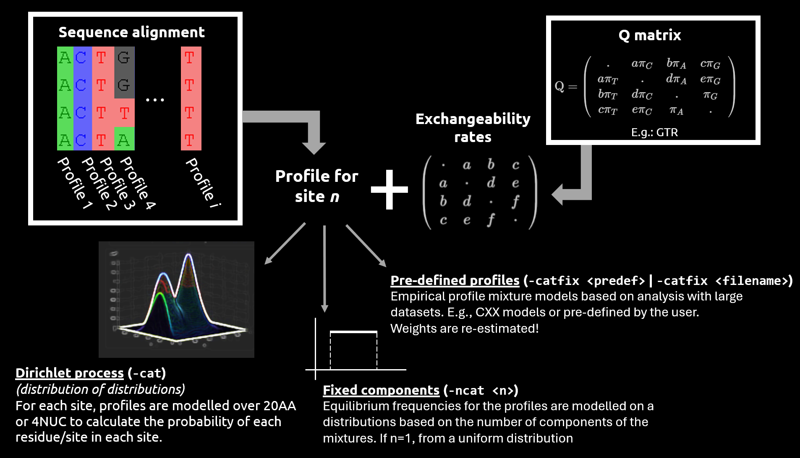

# Phylogeny inference with `PhyloBayes`

## Brief introduction

We have simulated a 5-taxon alignment consisting of 1,000 AA residues ([`prot_aln.phy`](mpi-pb/dat/prot_aln.phy)) under a specific model (we shall reveal this later! :smile: ). Inspired by [Kapli et al., 2023](http://abacus.gene.ucl.ac.uk/ziheng/pdf/2023Kapli-AA-DNA-trees-syad036.pdf), we also decided to assess the quality of phylogeny inference when using nucleotide data. Please note that we used ambiguous nucleotide alignments and kept the three codon positions of the nucleotide alignment.

> [!NOTE]
> In ambiguous nucleotide alignments, you shall see that some sites are not A, T, G, or C. Other letters such as `Y` or `R` will be used whenever there has been a conflict between more than one base being possible at one site.

At the end of the practical session, we shall have a general discussion based on the results we will have obtained. We shall also compare the methods we have followed in this session to the methods that [Kapli et al., 2023](http://abacus.gene.ucl.ac.uk/ziheng/pdf/2023Kapli-AA-DNA-trees-syad036.pdf) carried out.

* What do you think about our results? How do they compare to our "true" simulated tree?
* Have we done anything differently to [Kapli et al., 2023](http://abacus.gene.ucl.ac.uk/ziheng/pdf/2023Kapli-AA-DNA-trees-syad036.pdf)?
* If you were to carry out these analyses again, would you change anything? If so, which steps would you change and why?

But now, without further ado... Let's start our practical on Bayesian phylogeny inference with `PhyloBayes`!

## Input data

The input sequence files read by `PhyloBayes` must have a PHYLIP format:

```text

<num_taxa> <num_characters>

sp_1 
sp_2

.
.
.

sp_n
```

> [!IMPORTANT]
>
>* Taxa labels (or tag identifiers) may have more than 10 characters (i.e., "relaxed" PHYLIP format), but it is recommended to keep it short.
>* At least one space between the tag identifier and the first character of the sequence string is required. In other words, if you put at least one space after the tag identifier, `PhyloBayes` will expect you to start the sequence after such a space!
>* The following characters will all be considered equivalent to missing data: `-`, `?`, `$`, `.`, `*`, `X`, `x`, as well as the degenerate bases of nucleic acid sequences (`B`, `D`, `H`, `K`, `M`, `N`, `R`, `S`, `V`, `W`, `Y`), and the `B` and `Z` characters for protein sequences.

Please note that, even though we have used a 5-taxon tree topology to simulate our alignment, we will not be using an initial tree for the tree search nor constrain a specific tree topology under which sampling would take place (i.e., we will not use options `-t` or `-T`, respectively). We will try to see whether we can recover the same phylogeny when running `PhyloBayes`! Nevertheless, if you were to use the aforementioned options when analysing your dataset, please bear in mind that the input tree file should be in **NEWICK format**. In addition, the tag identifiers for the taxa present in your phylogeny must match those you have in your alignment (they are case sensitive!).

> [!IMPORTANT]
> If there are taxa that you included in your input tree file but you missed in your input sequence file, such taxa will be pruned from your tree topology. Nevertheless, if there are taxa present in the input sequence file but you did not include them in your input tree file, `PhyloBayes` will exit with an error message.

## The `CAT` model, exchangeability rates, and profile mixtures

The **CAT (categories) model** was proposed by Lartillot and Philippe ([2004](http://www.atgc-montpellier.fr/download/papers/cat_2004.pdf)) with the aim to relax the assumption that the same substitution process is responsible for how the sites of a protein evolve. The main key points of this model are the following:

* The tendency of each nucleotide or AA to be in a specific site position in a molecular alignment depends on various biological processes (e.g., selective constraints), and thus it is not equal (an assumption made by site-homogenous models). **Linking nucleotide or AA equilibrium frequencies** to the **substitution process** has shown to **reduce systematic errors** in phylogeny inference such as **long-branch attraction** problems, and it is **less prone to underestimate branch lengths**.

> [!NOTE]
> The `CAT` models implemented in `PhyloBayes` can account for among-site compositional heterogeneity when using both nucleotide and protein molecular alignments.

* Each site in the alignment is assigned a **frequency vector profile** over the 20 AA residues or the 4 nucleotide bases (i.e., not all residues/bases are equally probable at each site). By **combining such vector profiles** with a **globally defined set of exchange rates**, we can derive **site-specific substitution processes**. It is noteworthy that the global exchange rates can be fixed to **uniform** values (e.g., `-poi`; mixture of Poisson F81 process) or **empirical estimates** (e.g., `-lg`, `-wag`, `-jtt`, `-mtrev`, `-mtzoa`, `-mtart`) -- useful when analysing very large phylogenomic datasets to reduce computational time. Alternatively, they can also be **inferred from the data** (i.e., `-gtr`). Users can also implement their own custom set of exchange rates or mixture of profiles should they wish to do so (i.e., `-rr <filename>`; exchangeabilities are fixed to the values given in `<filename>`)!

> [!IMPORTANT]
> When combining **profiles** and **exchange rates**, it is important to bear in mind that any set of exchange rates can be combined with any type of the three implemented profile mixture models:
>
>* A Dirichlet process is used to infer the frequency profiles across sites: `-cat`. Non-parametric **Dirichlet processes** (sometimes considered as a "distribution of distributions" or "infinite mixture models") are used to model the aforementioned **site-specific equilibrium frequency profiles**. Note that Dirichlet processes assume that there are an infinite number of clusters/categories to which each site can be assigned, but we do not know _a priori_ which category each site goes to. In phylogenetic inference, each site of the input sequence alignment will be given a **frequency vector profile** over the 20 AA residues (if protein data) or over the 4 nucleotide bases (if nucleotide data). Such a vector will then be used to calculate the probability of each residue/base being at each site, hence why this process can account for among-site compositional heterogeneity.
>* A mixture of $n$ component/categories is **fixed**, but weights and profiles are random variables: `-ncat <n>`. If `-ncat 1`, a uniform density will be enabled to model the equilibrium frequency profiles across sites. In other words, there will be one unique matrix of profiles (one single category) for all the sites of the sequence alignment.
>* A mixture of **pre-defined profiles** are used (weights are re-estimated). Empirical models (e.g., CXX) used have a fixed number of components estimated on a large database of MSAs: `-catfix <predef>`.
>* A mixture of **user-pre-defined profiles** are used. Users may have established their own empirical model after estimating its fixed components on their dataset/s: `-catfix <filename>`.
>
> Nevertheless, the same set of exchange rates will be used by all components of the mixture!

E.g.: If the GTR model, `-gtr`, was chosen to infer the global exchange rates from nucleotide data...

> **Rate matrix (GTR)**

$$\mathrm{Q=}\left(\begin{array}{cccc}
. & a\pi_{C} & b\pi_{A} & c\pi_{G}\\
a\pi_{T} & . & d\pi_{A} & e\pi_{G}\\
b\pi_{T} & d\pi_{C} & . & f\pi_{G}\\
c\pi_{T} & e\pi_{C} & f\pi_{A} & .
\end{array}\right)$$

**Exchange rates**:

$$\mathrm{Q=}\left(\begin{array}{cccc}
. & a & b & c\\
a & . & d & e\\
b & d & . & f\\
c & e & f & .
\end{array}\right)$$

>> The exchange rates (free parameters) will be the same for all components of the mixture model selected by the user. The example above shows an example under the GTR model, but other matrices are available: `-poi`, `-lg`, `-wag`, `-jtt`, `-mtrev`, `-mtzoa`, `-mtart`, `-rr <filename>`.

**Equilibrium frequencies**:
$\left[\pi_{A},\pi_{T},\pi_{C},\pi_{G}\right]$

>> The equilibrium frequencies can vary depending on the mixture model being used: `-cat`, `-ncat <n>`, `-catfix <predef>`, `-catfix <filename>`.

If we try to put all the information above in one (very simplified!) image...

<p align="center">
 
</p>

* Some of the models you could try to run in `PhyloBayes` are shown below:

<table>

<!-- HEADER -->
<tr>
<th>Equilibrium frequencies<br>(Profile mixture model)</th>
<th>Exchange rates<br>(Uniform/Empirical/Estimated)</th>
<th><code>PhyloBayes</code> option </th>
</tr>
<!-- FIRST ROW -->
<tr>
<td rowspan="4">Among-site compositional heterogeneity (CAT)</td><td>Poisson</td><td><code>-cat -poisson</code></td>
</tr>
<tr>
<td>LG, WAG, JTT, MTREV, MTZOA, MTART</td><td><code>-cat -lg</code>, <code>-cat -wag</code>, <code>-cat -jtt</code>, <code>-cat -mtzoa</code>, <code>-cat -mtart</code></td>
</tr>
<tr>
<td>GTR</td><td><code>-cat -gtr</code></td>
</tr>
<tr>
<td>Own exchangeability rates</td><td><code>-cat -rr [user_filenam]></code></td>
</tr>
<!-- SECOND ROW -->
<tr>
<td rowspan="4">Among-site compositional homogeneity</td><td>Poisson</td><td><code>-ncat -poisson</code></td>
</tr>
<tr>
<td>LG, WAG, JTT, MTREV, MTZOA, MTART</td><td><code>-ncat 1 -lg</code>, <code>-ncat 1 -wag</code>, <code>-ncat 1 -jtt</code>, <code>-ncat 1 -mtzoa</code>, <code>-ncat 1 -mtart</code></td>
</tr>
<tr>
<td>GTR</td><td><code>-ncat 1-gtr</code> OR <code>-gtr</code></td>
</tr>
<tr>
<td>Own exchangeability rates</td><td><code>-ncat 1 -rr [user_filename]</code></td>
</tr>
<!-- THIRD ROW -->
<tr>
<td rowspan="4">Empirical mixture models, CXX (Quang et al., 2008) or WLSR5 (Wang et al., 2008) </td><td>Poisson</td><td><code>-catfix c10</code></td>
</tr>
<tr>
<td>LG, WAG, JTT, MTREV, MTZOA, MTART</td><td><code>-catfix C10 -lg</code>, <code>-catfix C10 -wag</code>, <code>-catfix WLSR5 -jtt</code>, <code>-catfix C10 -mtzoa </code>, <code>-catfix C10 -mtart</code></td>
</tr>
<tr>
<td>GTR</td><td><code>-catfix c60 -gtr</code></td>
</tr>
<tr>
<td>Own exchangeability rates</td><td><code>-catfix c60 -rr [user_filename]</code></td>
</tr>

</table>

## Running `PhyloBayes`

Once we have our simulated alignments ready, we can run `PhyloBayes`! We will carry out the following Bayesian phylogeny inferences with both the protein and back-translated ambiguous nucleotide alignments to see whether we can recover the true phylogeny that we simulated regardless of the type of data:

* `CAT+GTR`: **among-site compositional heterogeneity** is assumed. The exchangeability rates will be based on the GTR model (`-gtr`, exchangeability rates are free parameters and estimated) and a Dirichlet process will be used to infer the frequency profiles across sites (CAT model. `-cat`).
* `GTR`: **among-site compositional homogeneity** is assumed. The exchangeability rates will be based on the GTR model (`-gtr`, ) and a uniform density will be modelling equilibrium frequency profiles across sites (i.e., `-ncat 1`, one single matrix of profiles for all sites of the alignment).

> [!IMPORTANT]
> Other commands that we will be using:
>
> * `-s`: in `PhyloBayes` v4.9a, the "save all" mode is activated. In other words, both the tree topologies and all parameters sampled during the MCMC are saved. In the MPI version of `PhyloBayes` v1.9, this options does nothing.
> * `-d`: option used to specify the path to the input sequence file.
> * `-x`: the frequency with which the samples are saved can be specified, e.g., `-x 500` would save every 500 samples "forever" or until the chains are stopped. If a second number is included, however, one can also specify the number of samples that are to be collected so that the chains can stop. E.g., `-x 500 20000` would make `PhyloBayes` collect samples every 500 iterations until a total of 20,000 samples are saved, after which the chain will stop.

While yesterday you learnt how to use ML-based approaches to compare different evolutionary models, today you will learn how to use **cross-validation** to do so! First, we will create our working environment so that we can have as many directories (folders) as models we are going to be testing:

```sh
# Run from `mpi-pb`
for i in `seq 1 4`
do
mkdir -p {pb_prot_catgtr,pb_prot_gtr,pb_nuc_catgtr,pb_nuc_gtr,pb_prot_catlg,pb_prot_lg}/$i
done
```

Then, we will access one of the directories we have just created and run one chain under one model:

```sh
# Run from `mpi-pb`
# We will run one chain under the CAT+GTR model for protein data
cd pb_prot_catgtr/1
mpirun -np 2 pb_mpi -s -d ../../dat/prot_aln.phy -cat -gtr -x 10 10000 mpi_prot_catgtr_run$i &
# If you want to keep that PID number in a file, you can run
# the following code
pid=$!
echo Start job for chain 1 under and PI process $pid > log_pb_prot_catgtr_chain$i"_PID.txt"
```

As you can see, by typing the `&` at the end of the command that runs `PhyloBayes`, you can now keep using the terminal while the Bayesian program is running on the background! These analyses are not as quick as those you ran yesterday under a ML-based approach like (they can take from hours to months [even much longer sometimes] to reach convergence), and so we will be using the output files that we have already generated to continue the practical.

If you were to run these analyses on your own, however, you could use the code snippet below -- **please do not run the code below on the server because, if we all do this, we may collapse it!**

```sh
# Run from `mpi-pb`
# Run phylobayes under each model,
# 4 chains per model
## A. Protein data + CAT-GTR (heternogenous)
cd pb_prot_catgtr
for i in `seq 1 4`
do
cd $i
mpirun -np 2 pb_mpi -s -d ../../dat/prot_aln.phy -cat -gtr -x 10 10000 mpi_prot_catgtr_run$i &
pid=$!
if [[ $i -eq 1 ]]
then
echo Start job for chain $i under and PI process $pid > log_pb_prot_catgtr_chain$i"_PID.txt"
else
echo Start job for chain $i under and PI process $pid >> log_pb_prot_catgtr_chain$i"_PID.txt"
fi
cd ../
done
## B. Protein data + GTR (homogenous)
cd ../pb_prot_gtr
for i in `seq 1 4`
do
cd $i
mpirun -np 2 pb_mpi -s -d ../../dat/prot_aln.phy -ncat 1 -gtr -x 10 10000 mpi_prot_gtr_run$i &
pid=$!
if [[ $i -eq 1 ]]
then
echo Start job for chain $i under and PI process $pid > log_pb_prot_gtr_chain$i"_PID.txt"
else
echo Start job for chain $i under and PI process $pid >> log_pb_prot_gtr_chain$i"_PID.txt"
fi
cd ../
done
## C. Back-translated ambiguous nucleotide data + CAT-GTR (heterogenous)
cd ../pb_nuc_catgtr
for i in `seq 1 4`
do
cd $i
mpirun -np 2 pb_mpi -s -d ../../dat/nuc_aln.phy -cat -gtr -x 10 10000 mpi_nuc_catgtr_run$i &
pid=$!
if [[ $i -eq 1 ]]
then
echo Start job for chain $i under and PI process $pid > log_pb_nuc_catgtr_chain$i"_PID.txt"
else
echo Start job for chain $i under and PI process $pid >> log_pb_nuc_catgtr_chain$i"_PID.txt"
fi
cd ../
done
## D. Back-translated ambiguous nucleotide data + GTR (homogenous)
cd ../pb_nuc_gtr
for i in `seq 1 4`
do
cd $i
mpirun -np 2 pb_mpi -s -d ../../dat/nuc_aln.phy -ncat 1 -gtr -x 10 10000 mpi_nuc_gtr_run$i &
pid=$!
if [[ $i -eq 1 ]]
then
echo Start job for chain $i under and PI process $pid > log_pb_nuc_gtr_chain$i"_PID.txt"
else
echo Start job for chain $i under and PI process $pid >> log_pb_nuc_gtr_chain$i"_PID.txt"
fi
cd ../
done
## E. Protein data + CAT-LG (heternogenous)
cd ../pb_prot_catlg
for i in `seq 1 4`
do
cd $i
mpirun -np 2 pb_mpi -s -d ../../dat/prot_aln.phy -cat -lg -x 10 10000 mpi_prot_cat_lg_run$i &
pid=$!
if [[ $i -eq 1 ]]
then
echo Start job for chain $i under and PI process $pid > log_pb_prot_catlg_chain$i"_PID.txt"
else
echo Start job for chain $i under and PI process $pid >> log_pb_prot_catlg_chain$i"_PID.txt"
fi
cd ../
done
## F. Protein data + LG (homogenous)
cd ../pb_prot_lg
for i in `seq 1 4`
do
cd $i
mpirun -np 2 pb_mpi -s -d ../../dat/prot_aln.phy -ncat 1 -lg -x 10 10000 mpi_prot_lg_run$i &
pid=$!
if [[ $i -eq 1 ]]
then
echo Start job for chain $i under and PI process $pid > log_pb_prot_lg_chain$i"_PID.txt"
else
echo Start job for chain $i under and PI process $pid >> log_pb_prot_lg_chain$i"_PID.txt"
fi
cd ../
done
```

----

<details>
<summary><b>If you were to run the same analyses above but using `PhyloBayes` v4.9a...</b></summary>
<br>

```sh
# Run from `mpi-pb`
# First, create working directories for the chains
# we will run
for i in `seq 1 4`
do
mkdir -p {pb_prot_catgtr,pb_prot_gtr,pb_nuc_catgtr,pb_nuc_gtr,pb_prot_catlg,pb_prot_lg}/$i
done
# Run phylobayes under each model,
# 4 chains per model
## A. Protein data + CAT-GTR (heternogenous)
cd pb_prot_catgtr
for i in `seq 1 4`
do
cd $i
pb -s -d ../../dat/prot_aln.phy -cat -gtr -x 10 10000 prot_catgtr_run$i &
pid=$!
if [[ $i -eq 1 ]]
then
echo Start job for chain $i under and PI process $pid > log_pb_prot_catgtr_chain$i"_PID.txt"
else
echo Start job for chain $i under and PI process $pid >> log_pb_prot_catgtr_chain$i"_PID.txt"
fi
cd ../
done
## B. Protein data + GTR (homogenous)
cd ../pb_prot_gtr
for i in `seq 1 4`
do
cd $i
pb -s -d ../../dat/prot_aln.phy -ncat 1 -gtr -x 10 10000 prot_gtr_run$i &
pid=$!
if [[ $i -eq 1 ]]
then
echo Start job for chain $i under and PI process $pid > log_pb_prot_gtr_chain$i"_PID.txt"
else
echo Start job for chain $i under and PI process $pid >> log_pb_prot_gtr_chain$i"_PID.txt"
fi
cd ../
done
## C. Back-translated ambiguous nucleotide data + CAT-GTR (heterogenous)
cd ../pb_nuc_catgtr
for i in `seq 1 4`
do
cd $i
pb -s -d ../../dat/nuc_aln.phy -cat -gtr -x 10 10000 nuc_catgtr_run$i &
pid=$!
if [[ $i -eq 1 ]]
then
echo Start job for chain $i under and PI process $pid > log_pb_nuc_catgtr_chain$i"_PID.txt"
else
echo Start job for chain $i under and PI process $pid >> log_pb_nuc_catgtr_chain$i"_PID.txt"
fi
cd ../
done
## D. Back-translated ambiguous nucleotide data + GTR (homogenous)
cd ../pb_nuc_gtr
for i in `seq 1 4`
do
cd $i
pb -s -d ../../dat/nuc_aln.phy -ncat 1 -gtr -x 10 10000 nuc_gtr_run$i &
pid=$!
if [[ $i -eq 1 ]]
then
echo Start job for chain $i under and PI process $pid > log_pb_nuc_gtr_chain$i"_PID.txt"
else
echo Start job for chain $i under and PI process $pid >> log_pb_nuc_gtr_chain$i"_PID.txt"
fi
cd ../
done
## E. Protein data + CAT-LG (heternogenous)
cd ../pb_prot_catlg
for i in `seq 1 4`
do
cd $i
pb -s -d ../../dat/prot_aln.phy -cat -lg -x 10 10000 prot_catlg_run$i &
pid=$!
if [[ $i -eq 1 ]]
then
echo Start job for chain $i under and PI process $pid > log_pb_prot_catlg_chain$i"_PID.txt"
else
echo Start job for chain $i under and PI process $pid >> log_pb_prot_catlg_chain$i"_PID.txt"
fi
cd ../
done
## F. Protein data + LG (homogenous)
cd ../pb_prot_lg
for i in `seq 1 4`
do
cd $i
pb -s -d ../../dat/prot_aln.phy -ncat 1 -lg -x 10 10000 prot_lg_run$i &
pid=$!
if [[ $i -eq 1 ]]
then
echo Start job for chain $i under and PI process $pid > log_pb_prot_lg_chain$i"_PID.txt"
else
echo Start job for chain $i under and PI process $pid >> log_pb_prot_lg_chain$i"_PID.txt"
fi
cd ../
done
```

</details>

----

## Summarising output trace and tree files

Let's now work with the output files, which have been compressed and saved in directory [`pb_out`](pb_out):

```sh
# Run from `pb_out`
cd pb_out
for i in *gz
do
printf "\n[[ Extracting file "$i" ]]\n"
tar -xvf $i
#name=$( echo $i | sed 's/\.tar..*//' )
#mv $name/* ../mpi-pb/$name/
#rm -r $name
done
```

The most important output files that are generated by `PhyloBayes` are the following:

* `*treelist`: all sampled tree topologies with branch lengths are saved in this tree.
* `*trace`: this file contains all the summary statistics such as the log likelihood, the total tree length, the number of occupied components of the mixture, the mean site entropy, etc.
* `*chain`: the parameter configurations visited during each run are saved in this file. The number of lines of the trace file shows the current MCMC sample size (e.g., `wc -l *chain`). At least two chains must be run to check whether the samples collected independently have converged toward the same target distribution.

While the chains are running, you can check chain convergence and mixing by using the in-built `PhyloBayes` programs `bpcomp` and `tracecomp`. We can therefore assess whether the posterior consensus tree is reproducible across the two independent runs we launched under each model as well as the trace plots of the summary statistics capture the sub-components of the model seem to have reached a stationary distribution and are reproducible across runs.

To check for convergence of continuous parameters of the model, you can run the `tracecomp` program, which will parse the output files `*trace`:

```sh
# Run from `pb_prot_catgtr`
tracecomp -x 1 1/mpi_prot_catgtr_run1.trace 2/mpi_prot_catgtr_run2.trace 3/mpi_prot_catgtr_run3.trace 4/mpi_prot_catgtr_run4.trace
# You can also use regular expressions!
tracecomp -x 1 */*trace
# Now, you can put this in a loop to
# get the stats for all the runs!
# If you were inside `pb_prot_catgtr`...
cd ../
for i in pb_*
do
cd $i
printf "\n[[ Summarising traces for dataset "$i" ... ... ]]\n"
tracecomp -x 1 */*trace
cd ../
done
```

This command will generate a screen output similar to the following (numerical values will vary depending on how many iterations have been completed when you run the command!) for each of the models:

```text
setting upper limit to : 185
1/mpi_prot_catgtr_run1.trace     burnin : 1     sample size : 184
2/mpi_prot_catgtr_run2.trace     burnin : 1     sample size : 184
3/mpi_prot_catgtr_run3.trace     burnin : 1     sample size : 184
4/mpi_prot_catgtr_run4.trace     burnin : 1     sample size : 184
name                effsize     rel_diff

loglik              129         0.123073
length              151         0.107481
alpha               135         0.14003
Nmode               120         0.243349
statent             136         0.117031
statalpha           180         0.107909
rrent               176         0.073697
rrmean              134         0.148161
```

> [!NOTE]
> Only the table will be saved in a file called `tracecomp.contdiff` in the same directory where the command was run (i.e., inside each `pb_*` directory!).

The **effective sample size**, `effzise` column, can be used to estimate the **effective number of independent points that have been sampled by each chain**. The **discrepancy**, `rel_diff` column, is a statistic that shows the **mean deviation among the chains ran** (i.e., four chains in this case) for each of the parameters to be estimated (i.e., each column in the trace file) normalised by the within-chain standard deviation of the parameter to be estimated and averaged over all pairs of runs.

The following statistics would be **ideal**: an effective size of 1,000 and a discrepancy smaller than 0.1. Nevertheless, these values are somewhat _utopic_ within the field of phylogenomics due to the complex parameter space to be explored. Generally, as a rule of thumb:

* **Discrepancies** larger than **0.3** or slightly above and **effective sizes** larger than **50** tend to yield **acceptable runs**.
* **Discrepancies** larger than **0.1** or slightly above and **effective sizes** larger than **30** tend to yield **good runs**.

> [!NOTE]
> If we were happy with our summary statistics and decided to stop the chains, we could do so by typing `kill` and the name of the PID you were prompted. If you have stopped a run but wanted to resume it, you can type `pb <name_run>`.

Next, we can also run `bpcomp` to check the differences between bipartition frequencies when exploring the sampled trees:

```sh
# Run from `pb_prot_catgtr`
bpcomp -x 500 1/prot_catgtr_run1.treelist 2/prot_catgtr_run2.treelist
# You can also use regular expressions!
bpcomp -x 100 */*treelist
# Now, you can put this in a loop to
# get the stats for all the runs!
# If you were inside `pb_prot_catgtr`...
for i in pb_*
do
cd $i
printf "\n[[ Summarising trees for dataset "$i" ... ... ]]\n"
bpcomp -x 100 */*treelist
cd ../
done
```

You will see that, apart from getting the consensus tree (i.e., output file with extension `con.tre`), you will get two additional output files:

* `*.bplist`: output file that one should read to check which bipartitions present more discrepancies between chains -- you should see as many columns as chains were run! This bipartition list is merged to generate the consensus tree.
* `*.bpdiff`: `meandiff` and `maxdiff` values referring to the maximum and minimum difference values in bipartition frequencies among the chains run. If we obtained `maxdiff = 1`, the program would be hinting mixing issues: at least one clade appears with probability equal to 1 in one chain and 0 in another. File `*.bplist` can be used to further investigate which bipartitions are problematic and, if the clade of interest is not affected and discrepancies between chains are low, we could potentially continue our analysis.

Now, time to explore our runs with `Tracer`!

----

<details>
<summary><b>If you were to analyse the trace files output by `PhyloBayes` v4.9a...</b></summary>
<br>

There seems to be a couple of `#` in the header line, and so `Tracer` may not properly read this file. To fix this issue, you can do the following:

```sh
# Run from `mpi-pb`
for i in pb_*
do
cd $i
cp */*trace .
sed -i 's/\#//g' *trace
cd ../
done
```

> [!WARNING]
> If you have very large trace files, you may not want to create a copy and directly remove the `#` -- otherwise, you will run out of diskspace!

</details>

----

## Model selection

We are going to compare the various models we have ran for each dataset (i.e., 4 model for protein data and 2 models for nucleotide data) by conducting a "leave-one-out" cross-validation (LOO-CV) approach. Please note that, for large datasets, this approach may be too computationally demanding, and so other methods such as the widely applicable information criterion (wAIC) could be used instead -- such a score seems to give good enough approximations for datasets with > 4,000 sites.

Our dataset is relatively small, so we will obtain both the LOO-CV and wAIC scores. If the MCMC seems to have reached convergence and have large enough ESS VALUES based on the stats given by `tracecomp`, both scores should be equally reliable!

Firstly, we will run the in-built program `readpb_mpi` to calculate the site log likelihoods under each model:

```sh
# Run from `mpi-pb`
# Run model comparison under each model
# with each data type
## PROTEIN DATA
### A. Protein data + CAT-GTR (heternogenous)
cd pb_prot_catgtr/1
mpirun -np 2 readpb_mpi -x 100 10 -sitelogl mpi_prot_catgtr_run1 &
pid=$!
echo Start job for chain 1 and PI process $pid > log_pbmodsel_prot_catgtr_chain1_PID.txt
cd ../2
mpirun -np 2 readpb_mpi -x 100 10 -sitelogl mpi_prot_catgtr_run2 &
pid=$!
echo Start job for chain 1 and PI process $pid > log_pbmodsel_prot_catgtr_chain2_PID.txt
### B. Protein data + GTR (homogenous)
cd ../../pb_prot_gtr/1
mpirun -np 2 readpb_mpi -x 100 10 -sitelogl mpi_prot_gtr_run1 &
pid=$!
echo Start job for chain 1 and PI process $pid > log_pbmodsel_prot_gtr_chain1_PID.txt
cd ../2
mpirun -np 2 readpb_mpi -x 100 10 -sitelogl mpi_prot_gtr_run2 &
pid=$!
echo Start job for chain 1 and PI process $pid > log_pbmodsel_prot_gtr_chain2_PID.txt
### C. Protein data + CAT-LG (heternogenous)
cd ../../pb_prot_catlg/1
mpirun -np 2 readpb_mpi -x 100 10 -sitelogl mpi_prot_cat_lg_run1 &
pid=$!
echo Start job for chain 1 and PI process $pid > log_pbmodsel_prot_catlg_chain1_PID.txt
cd ../2
mpirun -np 2 readpb_mpi -x 100 10 -sitelogl mpi_prot_cat_lg_run2 &
pid=$!
echo Start job for chain 1 and PI process $pid > log_pbmodsel_prot_catlg_chain2_PID.txt
### D. Protein data + LG (homogenous)
cd ../../pb_prot_lg/1
mpirun -np 2 readpb_mpi -x 100 10 -sitelogl mpi_prot_lg_run1 &
pid=$!
echo Start job for chain 1 and PI process $pid > log_pbmodsel_prot_lg_chain1_PID.txt
cd ../2
mpirun -np 2 readpb_mpi -x 100 10 -sitelogl mpi_prot_lg_run2 &
pid=$!
echo Start job for chain 1 and PI process $pid > log_pbmodsel_prot_lg_chain2_PID.txt
## NUCLEOTIDE DATA
### A. Back-translated ambiguous nucleotide data + CAT-GTR (heterogenous)
cd ../../pb_nuc_catgtr/1
mpirun -np 2 readpb_mpi -x 100 10 -sitelogl mpi_nuc_catgtr_run1 &
pid=$!
echo Start job for chain 1 and PI process $pid > log_pbmodsel_nuc_catgtr_chain1_PID.txt
cd ../2
mpirun -np 2 readpb_mpi -x 100 10 -sitelogl mpi_nuc_catgtr_run2 &
pid=$!
echo Start job for chain 1 and PI process $pid > log_pbmodsel_nuc_catgtr_chain2_PID.txt
### B. Back-translated ambiguous nucleotide data + GTR (homogenous)
cd ../../pb_nuc_gtr/1
mpirun -np 2 readpb_mpi -x 100 10 -sitelogl mpi_nuc_gtr_run1 &
pid=$!
echo Start job for chain 1 and PI process $pid > log_pbmodsel_nuc_gtr_chain1_PID.txt
cd ../2
mpirun -np 2 readpb_mpi -x 100 10 -sitelogl mpi_nuc_gtr_run2 &
pid=$!
echo Start job for chain 1 and PI process $pid > log_pbmodsel_nuc_catgtr_chain2_PID.txt
cd ../
```

Once all the runs above have finished, we just need to collect the site-specific scores and use the `PhyloBayes` in-house script [`read_loocv_waic.py`](scripts/read_loocv_waic.py) to calculate the mean score per site and the bias and the error on the estimated values:

```sh
# Run from `mpi-pb`
## Summarise all analyses
for i in pb_*
do
cd $i
printf "\n[[ Results for analysis in directory "$i" ]]\n"
python3 ../../scripts/read_loocv_waic.py */*sitelogl
cd ../
done
```

> [!NOTE]
> We have used the samples we had already collected so that we could reuse the same chains to save computational time!

We have summarised the results below:

>> **NUCLEOTIDE DATA**

> GTR

| approach | debiased score  	|  bias	|   stdev	|  CI95min 	| CI95max  	|  ess 	| %(ess<10)  	|  f(ess<10)    |
|---	|---	|---	|---	|---	|---	|---	|---	|---	|
| LOO-CV  |       -2.3144 |    0.0000  |   0.0002 |   -2.3170 |   -2.3119  |  73.6298   |   0.000  |    0.000	|
| wAIC     |    -2.3144  |  -0.0000   |  0.0002  |  -2.3170  |  -2.3118  |  73.6390    |  0.000   |   0.000	|

> CAT+GTR

| approach | debiased score  	|  bias	|   stdev	|  CI95min 	| CI95max  	|  ess 	| %(ess<10)  	|  f(ess<10)    |
|---	|---	|---	|---	|---	|---	|---	|---	|---	|
| LOO-CV  |     -2.3149   |  0.0001  |   0.0007   | -2.3237 |   -2.3061  |  41.2324   |   0.000   |   0.000	|
| wAIC     |     -2.3148  |  -0.0001  |   0.0007  |  -2.3235  |  -2.3060  |  41.2418  |    0.000   |   0.000	|

>> **PROTEIN DATA**

> CAT+LG

| approach | debiased score  	|  bias	|   stdev	|  CI95min 	| CI95max  	|  ess 	| %(ess<10)  	|  f(ess<10)    |
|---	|---	|---	|---	|---	|---	|---	|---	|---	|
| LOO-CV  |      -8.4748  |   0.0013  |   0.0002  |  -8.4777 |   -8.4719 |   19.0750   |   0.000  |    0.000 	|
| wAIC     |     -8.4720  |  -0.0016   |  0.0001   | -8.4732  |  -8.4708  |  19.0761   |   0.000   |   0.0000 	|

> LG

| approach | debiased score  	|  bias	|   stdev	|  CI95min 	| CI95max  	|  ess 	| %(ess<10)  	|  f(ess<10)    |
|---	|---	|---	|---	|---	|---	|---	|---	|---	|
| LOO-CV  |      -8.4672  |   0.0003  |   0.0004  |  -8.4725 |   -8.4619  |  66.6877  |    0.000  |    0.000	|
| wAIC     |   -8.4667   | -0.0003  |   0.0004  |  -8.4719  |  -8.4615 |   66.7330   |   0.000   |   0.000 	|

> CAT+GTR

| approach | debiased score  	|  bias	|   stdev	|  CI95min 	| CI95max  	|  ess 	| %(ess<10)  	|  f(ess<10)    |
|---	|---	|---	|---	|---	|---	|---	|---	|---	|
| LOO-CV  |      -8.5460  |   0.0036   |  0.0073 |   -8.6385 |   -8.4535  |  23.7176   |   0.001  |    0.002 	|
| wAIC     |     -8.5398  |  -0.0030   |  0.0071 |   -8.6296  |  -8.4501  |  24.1468   |   0.000   |   0.000 	|

> GTR

| approach | debiased score  	|  bias	|   stdev	|  CI95min 	| CI95max  	|  ess 	| %(ess<10)  	|  f(ess<10)    |
|---	|---	|---	|---	|---	|---	|---	|---	|---	|
| LOO-CV  |      -8.5376   |  0.0014   |  0.0013  |  -8.5535 |   -8.5217 |   43.1695   |   0.000   |   0.000 	|
| wAIC     |     -8.5354   | -0.0011  |   0.0011  |  -8.5500  |  -8.5208  |  43.7315   |   0.000   |   0.000 	|

The interesting parameters are the "**debiased scores**". If we compare the models under which each data type has been analysed, we have the following:

>> **PROTEIN DATA**

$\textrm{LOO-CV| }\Delta (\textrm{GTR vs CAT+GTR}) = -8.5376 + 8.5460 = 0.0084$<br>
$\textrm{wAIC| }\Delta(\textrm{GTR vs CAT+GTR}) = -8.5354 + 8.5398 = 0.004$

$\textrm{LOO-CV| }\Delta (\textrm{LG vs CAT+LG}) = -8.4672 + 8.4748 = 0.0076$<br>
$\textrm{wAIC| }\Delta (\textrm{LG vs CAT+LG}) = -8.4667 + 8.4720 = 0.0053$

>> **NUCLEOTIDE DATA**

$\textrm{LOO-CV| }\Delta (\textrm{GTR vs CAT+GTR}) = -2.3144 + 2.3149 = 5e-04$<br>
$\textrm{wAIC| }\Delta (\textrm{GTR vs CAT+GTR}) = -2.3144 + 2.3148 = 4e-04$

As shown above, when comparing GTR VS GTR+CAT model for both both protein and nucleotide data, we can see that the GTR model fits the data better. When comparing LG VS LG+CAT model for protein data, the best-fitting model is the LG model. If we compare the debiased scores calculated for all the models ran with protein data, we can see that the LG model has a better score than the GTR model.

If we look at the ESS statistics, we can also assess how good the estimation has been. Ideally, both `%(ess<10)` and `f(ess<10)` should be less than 10%. Nevertheless, values around 0.3 should still provide reliable estimates. If you leave the chain run long enough (the results ran above were generated with chains that were running for 5 days!), convergence should eventually be reached and enough samples should be gathered to appropriately approximate the target distribution.

Before the big reveal (do not press the arrow below yet!), **what evolutionary model do you think we simulated the data with**?

----

<details>
<summary><b>Reveal only after you have had a guess! No spoilers!</b></summary>
<br>

We simulated a 5-taxon alignment consisting of 1,000 AA residues ([`prot_aln.phy`](mpi-pb/dat/prot_aln.phy)) under the empirical+F model implemented in the PAML program `evolver` specifying the following additional settings:

* Alpha value for the gamma distribution used to account for rate heterogeneity: 0.76634
* Number of categories to discretise the gamma distribution: 4
* AA substitution model: empirical+F model (`3`) using the LG exchangeability rates
* AA frequencies:

  ```text
  0.08795 0.07309 0.03045 0.04980 0.00873 0.03193 0.06778 0.07890 0.01988 0.07401
  A R N D C Q E G H I
  0.09850 0.05890 0.02529 0.03450 0.03928 0.04833 0.05270 0.00543 0.02701 0.08754
  L K M F P S T W Y V
  ```

These settings are ML estimates that were obtained in a previous analysis when analysing a bacterial dataset with `CODEML`. Inspired by the results published by [Kapli et al. 2023](http://abacus.gene.ucl.ac.uk/ziheng/pdf/2023Kapli-AA-DNA-trees-syad036.pdf), we also decided to assess the quality of phylogeny inference when using nucleotide data. We have back-translated the protein sequences into ambiguous nucleotide  sequences with `backtranambig` and kept all codon positions.

> [!NOTE]
> The `backtranambig` EMBOSS tool can be installed by running the command `sudo apt-get install emboss`, which works on Linux and WSL systems. Mac OS X may follow the [installation instructions on the EMBOSS website](https://emboss.sourceforge.net/apps/cvs/emboss/apps/backtranambig.html).

In addition, the "true" tree in our simulation was the following:

```text
(A:0.25174,(B:0.218295,(C:0.345861,D:0.587524):0.577136):0.301518,E:0.1);
```

</details>

----

Now, its is noteworthy to mention that [Kapli et al. 2023](http://abacus.gene.ucl.ac.uk/ziheng/pdf/2023Kapli-AA-DNA-trees-syad036.pdf) suggest that using only **the first and the second codon positions** in **DNA** sequences may be as good as protein sequences for inferring deep phylogenies.

Based on what we have done today and what we have been discussing so far during the course, let's go back to the questions we started with and address them all together!

* What do you think about our results? How do they compare to our "true" simulated tree?
* Have we done anything differently to [Kapli et al., 2023](http://abacus.gene.ucl.ac.uk/ziheng/pdf/2023Kapli-AA-DNA-trees-syad036.pdf)?
* If you were to carry out these analyses again, would you change anything? If so, which steps would you change and why?

<br>
<hr>
<br>
Hope you have enjoyed today's Bayesian phylogeny inference practical and... See you on Friday to learn more about Bayesian timetree inference with `MCMCtree`!
